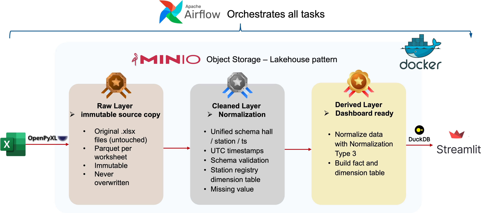

# Energy Pipeline

## Overview

`energy_pipeline` is a containerized data engineering project that ingests messy Excel energy measurement files, stores them in an S3-compatible bronze/silver/gold data lake, and exposes an analytics dashboard.

The pipeline is orchestrated with Apache Airflow, uses MinIO for object storage, DuckDB for Parquet-based transformations, and Streamlit for visualization.

## Architecture

- `MinIO` stores data in three zones:
  - `bronze` — raw Excel files plus raw Parquet extracts
  - `silver` — normalized and cleaned Parquet files
  - `gold` — aggregated analytics-ready Parquet tables
- `Postgres` is used by Airflow for metadata storage.
- `Airflow` runs the `energy_pipeline_dag` to execute ingestion, transformation, aggregation, and notification.
- `Streamlit` serves a dashboard that reads the gold layer from MinIO.

## Key Features

- Detects newly uploaded `.xlsx` files in `data/input`
- Parses non-standard Excel worksheets using `openpyxl`
- Stores original source files and raw structured output in the bronze zone
- Normalizes timestamps, measurement columns, and hall/station metadata in the silver zone
- Builds gold star schema tables for analytics and dashboard queries
- Provides an interactive energy consumption dashboard at `http://localhost:8501`

## Prerequisites

- Docker and Docker Compose installed
- At least one `.xlsx` file placed in `data/input/`
- A `.env` file in the repository root containing MinIO credentials and bucket names

## Setup and Run

From the project root:

```bash
docker compose up -d --build
```

Then open the following services:

- Airflow Web UI: `http://localhost:8080` (login `admin` / `admin`)
- MinIO Console: `http://localhost:9001`
- Streamlit Dashboard: `http://localhost:8501`

## Pipeline Flow

1. `dags/energy_pipeline_dag.py` schedules the pipeline daily and watches `data/input/*.xlsx`.
2. `scripts/ingest_data.py` uploads each Excel file to bronze and extracts worksheets into Parquet.
3. `scripts/clean_data.py` normalizes raw station Parquet files and writes cleaned output to silver.
4. `scripts/derive_data.py` builds analytics-ready gold tables from the silver layer.
5. `scripts/notify.py` writes a run success/failure log and helps alert on failures.



## Dashboard

The dashboard is implemented in `dashboard/app.py` and uses:

- `dashboard/queries.py` to query gold data via DuckDB
- `dashboard/charts.py` to render Plotly charts
- `dashboard/style.css` for styling

It supports filtering by date range, hall, time grain, and station drill-down.

## Project Structure

- `docker-compose.yml` - service definitions for MinIO, Postgres, Airflow, and Streamlit
- `Dockerfile.airflow` - Airflow service build image
- `Dockerfile.streamlit` - Streamlit service build image
- `dags/energy_pipeline_dag.py` - Airflow DAG definition
- `scripts/` - ETL and storage helper scripts
- `dashboard/` - Streamlit dashboard and query/chart code
- `data/input/` - drop source Excel files here

## Notes

- The pipeline expects Excel files with non-standard header rows and uses `openpyxl` to extract data reliably.
- The Airflow file sensor will wait up to 10 minutes for new files before marking a run as skipped.
- When running outside Docker, the same environment variables are required for MinIO connectivity.

## License

This repository is provided as an educational energy data pipeline example.